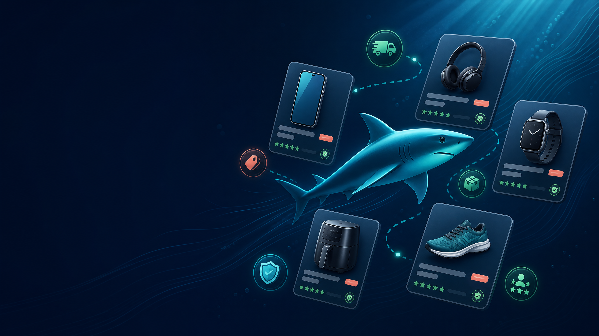
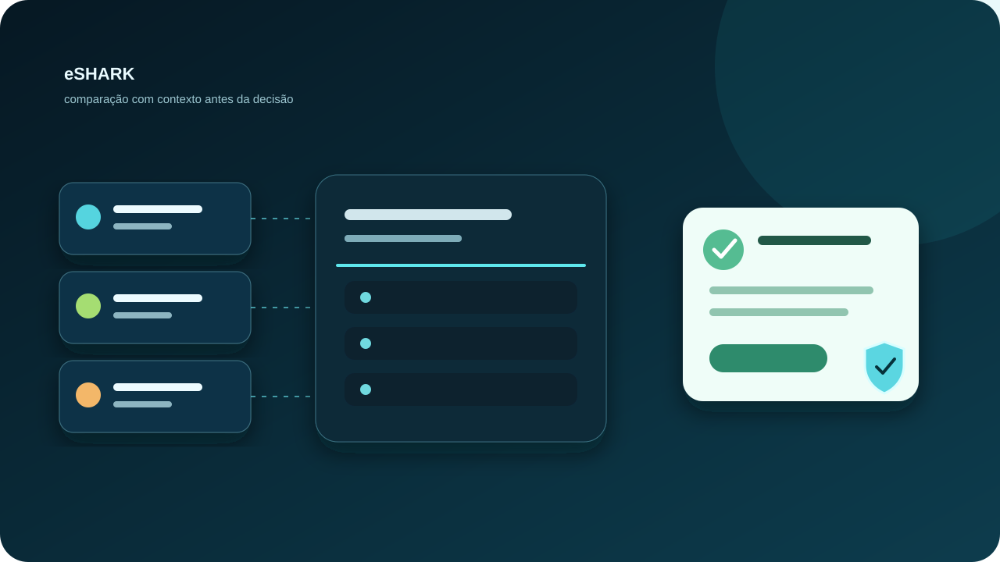
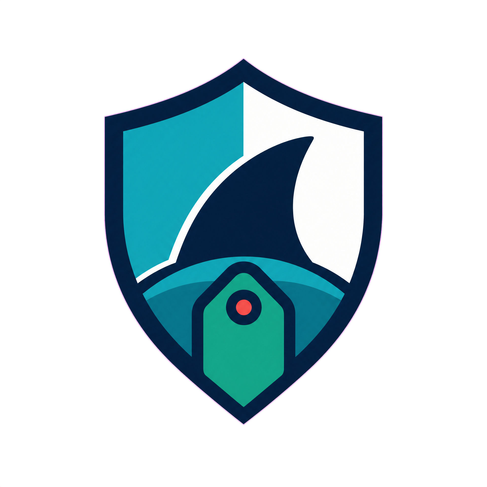

# eShark

<p align="center">
  
</p>



<p align="center">
  <strong>Central inteligente de ofertas para comparar preço, frete, prazo e reputação em uma única decisão.</strong>
</p>

<p align="center">
  <a href="#como-funciona">Como funciona</a> ·
  <a href="#segurança-e-privacidade">Segurança</a> ·
  <a href="#executar-localmente">Executar localmente</a> ·
  <a href="#roadmap">Roadmap</a>
</p>

---

## O que é o eShark?

O **eShark** é um protótipo de PWA para descoberta e comparação de ofertas. Em vez de priorizar apenas o menor preço, o projeto combina **custo total**, **frete**, **prazo de entrega**, **reputação do vendedor** e benefícios como frete grátis para apresentar a alternativa mais adequada ao perfil do usuário.

> O catálogo e as ofertas atuais são dados de demonstração. Integrações reais de catálogo, programas de afiliados, autenticação e persistência estão descritas no roadmap.

| Foco | Como o projeto aborda |
|---|---|
| Melhor oferta | Motor de decisão pondera preço, envio, prazo e confiabilidade. |
| Transparência | A origem da oferta aparece antes de qualquer redirecionamento externo. |
| Privacidade | O PWA mantém recursos locais e prioriza práticas defensivas no frontend. |
| Experiência mobile | Interface responsiva, instalável e preparada para uso offline. |

## Como funciona

<p align="center">
  
</p>

Para cada produto, a engine avalia as ofertas disponíveis e calcula uma pontuação ponderada. A menor pontuação representa a recomendação principal, explicando de forma objetiva quais fatores contribuíram para a escolha.

```text
score = preço + frete + prazo + risco de reputação
        - benefícios de compra
        + penalidades de confiabilidade
```

O usuário pode ajustar o modo de decisão entre **balanceado**, **mais barato**, **mais rápido** e **mais confiável**.

## Segurança e privacidade

<p align="center">
  
</p>

O projeto inclui uma base defensiva para demonstração e evolução: sanitização de conteúdo exibido, lista permitida para URLs externas, validação de entradas, headers de segurança, política de conteúdo e regras de acesso restritivas para o backend de referência.

O eShark **não processa pagamentos**. Quando uma oferta é selecionada, o usuário recebe um aviso claro antes de ser direcionado ao parceiro externo.

## Tecnologias

`HTML` · `CSS` · `JavaScript` · `PWA` · `Service Worker` · `Firebase (referência)` · `Firestore Rules`

## Executar localmente

```bash
git clone https://github.com/LEVIATAD21/eshark.git
cd eshark
python3 -m http.server 8080
```

Abra `http://localhost:8080` no navegador. Para testar a experiência mobile, use o modo de dispositivo das ferramentas de desenvolvimento.

## Estrutura do projeto

```text
eshark/
├── index.html              # Estrutura principal do PWA
├── css/style.css           # Sistema visual responsivo
├── js/decision.js          # Motor de decisão de ofertas
├── js/security.js          # Camadas defensivas do frontend
├── js/data.js              # Catálogo de demonstração e ofertas
├── backend/                # Regras e exemplos de backend
├── docs/                   # Segurança e instruções de deploy
└── assets/                 # Ilustrações do produto e documentação
```

## Roadmap

- [ ] Integrar fontes reais de catálogo e programas de afiliados autorizados.
- [ ] Conectar autenticação e persistência reais.
- [ ] Adicionar alertas de preço com consentimento do usuário.
- [ ] Implementar testes automatizados para a engine de decisão.
- [ ] Publicar uma demonstração controlada com dados verificáveis.

## Documentação complementar

- [Modelo de segurança](docs/SECURITY.md)
- [Guia de deploy](docs/DEPLOY.md)
- [Documentação técnica original](docs/README.md)

---

<p align="center">Projeto em evolução, com foco em comparação transparente, experiência mobile e desenvolvimento seguro.</p>
